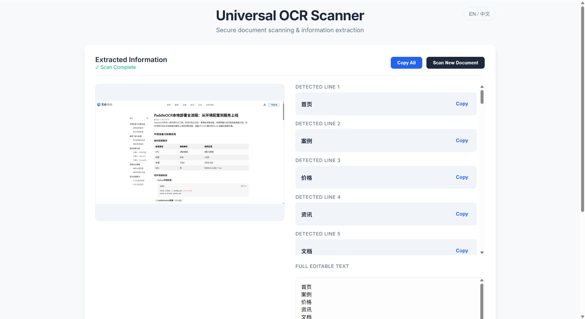

# 通用 OCR 扫描仪

本项目提供了一个基于 Web 的光学字符识别 (OCR) 扫描仪。它使用 **FastAPI** 作为后端，集成 **PaddleOCR** 进行文本检测和识别，前端采用简洁的 **HTML/Vue.js** 开发。

## 功能特点
- **通用 OCR**: 检测并提取图片中的文字（默认支持中英文）。
- **FastAPI 后端**: 高效现代的 Python Web API。
- **隐私保护**: 所有处理均在本地进行，数据不会上传云端。

## 环境要求
- Python 3.8+
- pip

## 部署参考文档

[PaddleOCR本地部署全流程：从环境配置到服务上线](https://comate.baidu.com/zh/page/87zkw692bec)


## 安装说明

1.  **克隆/下载** 本项目代码。
2.  **安装服务端依赖**:
    - **CPU 版本**:
      
      ```bash
      pip install -r requirements.txt
      ```
    - **GPU 版本 (推荐)**:
      ```bash
      # 针对 CUDA 12.x 环境 (如 本地环境)
      pip install paddlepaddle-gpu -i https://www.paddlepaddle.org.cn/packages/stable/cu126/
      pip install -r requirements.txt
      ```

## 使用说明

### 1. 启动后端服务
在项目根目录下运行以下命令：
```bash
uvicorn server:app --host 0.0.0.0 --port 8866
```
服务将在 `http://localhost:8866` 启动。

### 2. 打开前端页面
直接在浏览器中打开 `index.html` 文件即可。

### 3. 扫描文档
- 点击上传区域或拖拽图片文件。
- 系统将在本地处理图片。
- 识别出的文字将显示在结果列表中。
- 您可以复制单行文字，或重置以扫描新文档。

## API 接口
- **POST** `/ocr`
    - 接受 `multipart/form-data` 格式，文件字段名为 `file`。
    - 返回 `{"result": ["识别文本行 1", "识别文本行 2", ...]}`。


## 效果展示




## 版本

```text
paddlepaddle-gpu==3.2.2
paddleocr==3.3.2
fastapi==0.127.0
uvicorn==0.40.0
opencv-python==4.12.0.88
python-multipart==0.0.21
numpy==2.2.6
```

```text
~\.paddlex\official_models>tree

├─en_PP-OCRv5_mobile_rec
├─PP-LCNet_x1_0_doc_ori
├─PP-LCNet_x1_0_textline_ori
├─PP-OCRv5_server_det
├─PP-OCRv5_server_rec
└─UVDoc
```

```text
~\nvidia-smi
NVIDIA-SMI 560.94                 Driver Version: 560.94         CUDA Version: 12.6
```