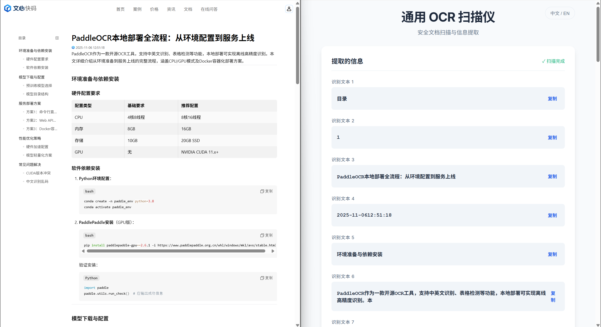

# Universal OCR Scanner

This project provides a web-based Optical Character Recognition (OCR) scanner. It uses a **FastAPI** backend with **PaddleOCR** for text detection and recognition, and a simple **HTML/Vue.js** frontend.

## Features
- **Universal OCR**: Detects and extracts text from images (Chinese/English support by default).
- **FastAPI Backend**: Efficient and modern Python web API.
- **Privacy**: Processing happens locally; no data is sent to the cloud.

## Prerequisites
- Python 3.8+
- pip

## Reference tutorial for deploying

[PaddleOCR本地部署全流程：从环境配置到服务上线](https://comate.baidu.com/zh/page/87zkw692bec)

## Installation

1.  **Clone/Download** the repository.
2.  **Install server dependencies**:
    - **CPU Version**:
      ```bash
      pip install paddlepaddle paddleocr fastapi uvicorn opencv-python python-multipart numpy
      ```
    - **GPU Version (Recommended)**:
      ```bash
      # For CUDA 12.x environment (like this local setup)
      pip install paddlepaddle-gpu -i https://www.paddlepaddle.org.cn/packages/stable/cu126/
      pip install paddleocr fastapi uvicorn opencv-python python-multipart numpy
      ```

## Usage

### 1. Start the Backend Server
Run the following command in the project directory:
```bash
uvicorn server:app --host 0.0.0.0 --port 8866
```
The server will start at `http://localhost:8866`.

### 2. Open the Frontend
Simply open `index.html` in your web browser.

### 3. Scan Documents
- Click or drag an image into the upload area.
- The system will process the image locally.
- Extracted text will be displayed in the result list.
- You can copy individual lines or reset to scan a new document.

## API Endpoint
- **POST** `/ocr`
    - Accepts `multipart/form-data` with a file field named `file`.
    - Returns `{"result": ["Detected Text Line 1", "Detected Text Line 2", ...]}`.


## Demo




## FYI

```text
paddlepaddle-gpu==3.2.2
paddleocr==3.3.2
fastapi==0.127.0
uvicorn==0.40.0
opencv-python==4.12.0.88
python-multipart==0.0.21
numpy==2.2.6
```

```text
~\.paddlex\official_models>tree

├─en_PP-OCRv5_mobile_rec
├─PP-LCNet_x1_0_doc_ori
├─PP-LCNet_x1_0_textline_ori
├─PP-OCRv5_server_det
├─PP-OCRv5_server_rec
└─UVDoc
```
